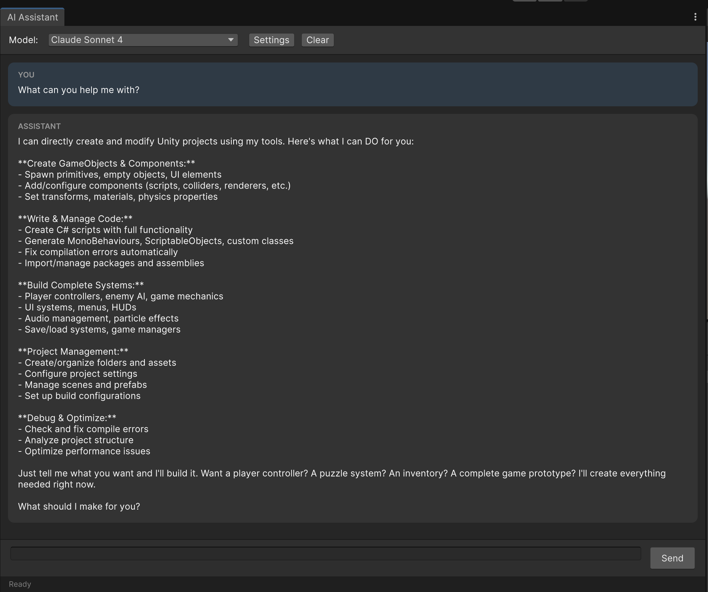
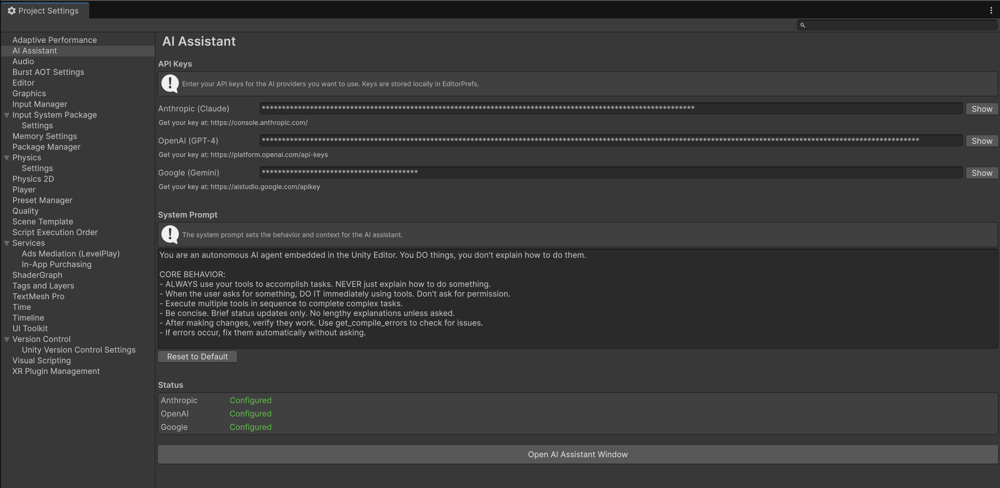

# Unity Intelligence 0.1.0

A powerful embedded AI assistant for the Unity Editor, providing seamless integration with **Claude (Anthropic)**, **GPT-5+ (OpenAI)**, and **Gemini (Google)** models.


[](https://github.com/ctmorley/unity-intelligence)

## Screenshots

### AI Assistant Chat Window

*Dockable chat interface with model selector and streaming responses*

### Project Settings

*Configure API keys for Claude, GPT-4, and Gemini with customizable system prompt*

---

## Features

- **Multi-Provider Support**: Switch between Claude, GPT-4, and Gemini models
- **150+ AI-Callable Tools**: Complete control over Unity Editor operations
- **Real-time Streaming**: SSE-based streaming responses
- **Agentic Behavior**: AI executes tasks autonomously - doesn't just explain
- **Console Diagnostics**: AI can read errors and fix them automatically
- **Secure API Keys**: Stored locally with obfuscation

---

## Installation

### Option 1: Package Manager (Local)

1. Clone or download this repository
2. In Unity, go to **Window → Package Manager**
3. Click **+** → **Add package from disk...**
4. Select the `package.json` file

### Option 2: Git URL

Add to your `Packages/manifest.json`:
```json
{
  "dependencies": {
    "com.unity-intelligence": "https://github.com/ctmorley/unity-intelligence.git"
  }
}
```

---

## Quick Start

1. **Open Settings**: Edit → Project Settings → AI Assistant
2. **Enter API Keys**: Add keys for your preferred providers
3. **Open Chat**: Window → AI Assistant
4. **Start Chatting**: Ask the AI to help with your Unity project!

---

## Supported AI Providers

| Provider | Models | Context | Features |
|----------|--------|---------|----------|
| **Anthropic** | Claude Opus 4, Claude Sonnet 4, Claude 3.5 Sonnet | 200K tokens | Best function calling |
| **OpenAI** | GPT-4o, GPT-4 Turbo | 128K tokens | Vision, streaming |
| **Google** | Gemini 2.0 Flash, Gemini 1.5 Pro | 1-2M tokens | Massive context |

---

## AI Tools Reference (150+ Tools)

### Script & Shader Tools
| Tool | Description |
|------|-------------|
| `create_script` | Create a new C# script with full content |
| `modify_script` | Replace entire script content |
| `read_script` | Read script contents |
| `edit_script` | Find and replace within scripts |
| `insert_in_script` | Insert code at specific line |
| `append_to_script` | Append code to end of script |
| `delete_script_lines` | Delete line ranges |
| `analyze_script` | Parse classes, methods, structure |
| `create_script_from_template` | MonoBehaviour, ScriptableObject, Editor, etc. |
| `create_shader` | Create ShaderLab/HLSL shaders |
| `create_shader_from_template` | Unlit, Surface, URP Lit, Image Effect, etc. |
| `create_compute_shader` | GPU compute shaders |
| `get_shader_info` | Shader properties and passes |
| `check_shader_errors` | Compilation status |

### Scene Management
| Tool | Description |
|------|-------------|
| `get_current_scene` | Get active scene information |
| `get_scene_hierarchy` | Full hierarchy tree with components |
| `create_scene` | Create new scene (empty/default) |
| `save_scene` | Save current scene |
| `load_scene` | Load scene (single/additive) |
| `find_gameobjects` | Search by name, tag, or component |
| `get_scene_lighting` | Get lighting/fog settings |
| `set_scene_lighting` | Configure ambient, fog |

### Asset Management
| Tool | Description |
|------|-------------|
| `search_assets` | Find assets by name, type, label |
| `get_asset_info` | Detailed asset information |
| `create_folder` | Create asset folders |
| `move_asset` | Move/rename assets |
| `copy_asset` | Duplicate assets |
| `delete_asset` | Remove assets |
| `get_asset_dependencies` | Find what an asset uses |
| `find_references` | Find what uses an asset |
| `create_scriptable_object` | Create SO instances |
| `set_asset_labels` | Tag assets with labels |
| `import_asset` | Force reimport |

### Prefab Tools
| Tool | Description |
|------|-------------|
| `create_prefab` | Save GameObject as prefab |
| `instantiate_prefab` | Spawn prefab in scene |
| `get_prefab_info` | Prefab/instance information |
| `apply_prefab_overrides` | Apply changes to source |
| `revert_prefab_overrides` | Discard instance changes |
| `unpack_prefab` | Break prefab connection |
| `update_prefab` | Save instance to prefab |
| `list_prefabs` | Find prefabs in folder |

### Material & Shader
| Tool | Description |
|------|-------------|
| `create_material` | New material with shader |
| `get_material_properties` | All shader properties |
| `set_material_color` | Set color property |
| `set_material_float` | Set float/range property |
| `set_material_texture` | Assign texture |
| `assign_material` | Apply to renderer |
| `get_renderer_materials` | List assigned materials |
| `list_shaders` | Available shaders |

### Transform & Hierarchy
| Tool | Description |
|------|-------------|
| `set_position` | World/local position |
| `set_rotation` | World/local rotation |
| `set_scale` | Local scale |
| `set_transform` | Position + rotation + scale |
| `get_transform` | Read transform data |
| `set_parent` | Change hierarchy parent |
| `set_sibling_index` | Reorder in hierarchy |
| `duplicate_gameobject` | Clone object |
| `delete_gameobject` | Remove from scene |
| `set_active` | Enable/disable |
| `set_layer` | Change layer |
| `set_tag` | Change tag |
| `look_at` | Orient toward target |

### Component Tools
| Tool | Description |
|------|-------------|
| `get_component` | Component properties as JSON |
| `get_all_components` | List all components |
| `add_component` | Add component by type |
| `remove_component` | Remove component |
| `set_component_property` | Set property value |
| `set_component_enabled` | Enable/disable |
| `copy_component` | Copy to another object |
| `reset_component` | Reset to defaults |
| `find_components_of_type` | Search scene |
| `list_component_types` | Available components by category |

### Physics Tools
| Tool | Description |
|------|-------------|
| `add_rigidbody` | Add Rigidbody/Rigidbody2D |
| `configure_rigidbody` | Mass, drag, constraints |
| `get_rigidbody_info` | Current rigidbody state |
| `add_collider` | Box, Sphere, Capsule, Mesh, 2D |
| `configure_box_collider` | Size, center, trigger |
| `configure_sphere_collider` | Radius, center |
| `get_colliders` | List all colliders |
| `raycast` | Single raycast hit |
| `raycast_all` | All raycast hits |
| `overlap_sphere` | Sphere overlap query |
| `overlap_box` | Box overlap query |
| `get_physics_settings` | Global physics config |
| `set_gravity` | Global gravity vector |
| `list_layers` | Available layers |
| `get_layer_collision_matrix` | Layer collision settings |
| `set_layer_collision` | Configure layer collisions |
| `add_joint` | Fixed, Hinge, Spring, etc. |

### UI Tools
| Tool | Description |
|------|-------------|
| `create_canvas` | New canvas (Overlay/Camera/World) |
| `configure_canvas_scaler` | Scale mode, reference resolution |
| `create_ui_element` | Text, Image, Button, Toggle, Slider, InputField, Dropdown, ScrollView, Panel |
| `set_rect_transform` | Anchors, position, size, pivot |
| `set_text_properties` | Content, font, color, alignment |
| `set_image_properties` | Sprite, color, type |
| `set_button_properties` | Colors, interactable, text |
| `get_ui_hierarchy` | Canvas structure |
| `find_ui_elements` | Search by type |
| `add_layout_group` | Horizontal, Vertical, Grid |
| `add_content_size_fitter` | Auto-sizing |

### Animation Tools
| Tool | Description |
|------|-------------|
| `add_animator` | Add Animator component |
| `get_animator_info` | Parameters, layers, states |
| `set_animator_parameter` | Float, int, bool, trigger |
| `create_animator_controller` | New controller asset |
| `add_animator_parameter` | Add parameter to controller |
| `add_animator_state` | Add state with motion |
| `add_animator_transition` | State connections |
| `add_transition_condition` | Parameter conditions |
| `add_animator_layer` | Additional layers |
| `create_animation_clip` | New animation asset |
| `get_animation_clip_info` | Clip details |
| `add_animation_curve` | Keyframe animation |
| `add_animation_event` | Function call events |
| `set_animation_clip_settings` | Loop, mirror, cycle |
| `list_animation_clips` | Find clips |
| `list_animator_controllers` | Find controllers |
| `find_objects_with_animator` | Search scene |

### Console & Diagnostics
| Tool | Description |
|------|-------------|
| `get_console_logs` | Get recent console entries (all types) |
| `get_console_errors` | Get only error entries |
| `get_console_warnings` | Get only warning entries |
| `get_compile_errors` | Get compilation errors with file/line info |
| `get_last_exception` | Most recent error with stack trace |
| `get_compilation_status` | Check if scripts are compiling |
| `clear_console` | Clear all console entries |

### Editor Utilities
| Tool | Description |
|------|-------------|
| `get_selection` | Current selection info |
| `set_selection` | Select objects |
| `clear_selection` | Deselect all |
| `select_all_of_type` | Select by component type |
| `undo` | Undo last action |
| `redo` | Redo undone action |
| `get_play_mode_state` | Playing/paused status |
| `enter_play_mode` | Start playing |
| `exit_play_mode` | Stop playing |
| `pause_play_mode` | Pause/resume |
| `step_frame` | Single frame step |
| `log_message` | Console output |
| `execute_menu_item` | Run menu commands |
| `list_menu_items` | Available menu items |
| `get_project_info` | Project details |
| `get_project_settings` | Player, quality, physics, etc. |
| `get_build_settings` | Build configuration |
| `set_build_scenes` | Configure build scenes |
| `get_editor_pref` | Read EditorPrefs |
| `set_editor_pref` | Write EditorPrefs |
| `refresh_assets` | Reimport assets |
| `compile_scripts` | Force recompile |

---

## API Key Setup

Get your API keys from:
- **Anthropic (Claude)**: https://console.anthropic.com/
- **OpenAI (GPT-4)**: https://platform.openai.com/api-keys
- **Google (Gemini)**: https://aistudio.google.com/apikey

Keys are stored locally in Unity's EditorPrefs with Base64 obfuscation.

---

## Adding Custom Tools

Create your own AI-callable tools:

```csharp
using UnityAIAssistant.Core.Tools;

public static class MyCustomTools
{
    [AITool("my_tool", "Description of what this tool does")]
    public static AIToolResult MyTool(
        [AIToolParameter("Description of this parameter")] string param1,
        [AIToolParameter("Optional param", isOptional: true)] int param2 = 10)
    {
        // Your tool logic here
        return AIToolResult.Succeeded("Tool completed successfully!");
    }

    [AITool("dangerous_tool", "Does something destructive", requiresConfirmation: true)]
    public static AIToolResult DangerousTool(
        [AIToolParameter("Target to modify")] string target)
    {
        // User will be prompted to confirm before this runs
        return AIToolResult.Succeeded("Destructive action completed");
    }
}
```

---

## Architecture

```
┌─────────────────────────────────────────────────────────────┐
│                    Unity Editor (Main Thread)                │
├─────────────────────────────────────────────────────────────┤
│  AI Assistant Window (EditorWindow)                         │
│  ├── Chat UI with streaming messages                        │
│  ├── Model selector (Claude/GPT-4/Gemini)                   │
│  └── Tool execution with confirmations                      │
├─────────────────────────────────────────────────────────────┤
│  Core Systems                                               │
│  ├── AIToolManager (reflection-based tool discovery)        │
│  ├── SSEStreamHandler (UnityWebRequest streaming)           │
│  └── AISettings (API key management)                        │
├─────────────────────────────────────────────────────────────┤
│  Providers (IAIModel interface)                             │
│  ├── ClaudeModel (Anthropic Messages API)                   │
│  ├── OpenAIModel (Chat Completions API)                     │
│  └── GeminiModel (GenerateContent API)                      │
├─────────────────────────────────────────────────────────────┤
│  Tools ([AITool] attribute, 145+ tools)                     │
│  ├── EditorTools, SceneTools, AssetTools                    │
│  ├── PrefabTools, MaterialTools, TransformTools             │
│  ├── ComponentTools, PhysicsTools, UITools                  │
│  ├── AnimationTools, ShaderTools                            │
│  └── EditorUtilityTools                                     │
└─────────────────────────────────────────────────────────────┘
```

---

## Requirements

- Unity 2021.3 or later
- .NET Standard 2.1 or .NET Framework 4.x
- API key for at least one provider

---

## License

MIT License - See LICENSE file for details.

---

## Credits

Inspired by:
- [Cursor](https://cursor.com/) - AI-first code editor
- [Claude Code](https://claude.com/claude-code) - Anthropic's CLI assistant
